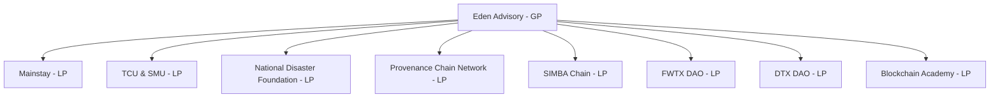

# OPERATION COWBOY MARTIAN

## Introduction
This proposal is submitted in response to the NSF Engine initiative, aiming to develop a sustainable, inclusive regional innovation ecosystem. The focus is on disaster relief, community wellness, and workforce development through the integration of advanced technology and community-driven approaches.

## Collaborating Entities
- **Eden Advisory** (Lead: Tobalo Torres) - General Partner - Role: Syndicator & Chief Architect
- **Mainstay** (Lead: Kelly Massad) - Limited Partner  - Role: Media Partner
- **TCU, SMU, Dallas College, Tarrant County College, UTA** (Leads: Ed Ipser, Kelly Slaughter; Simon Mak, Amy Mackenroth) - Limited Partners - Role: Share Lab and Technology Asset Access and Talent Farming / Development
- **National DigiFoundry (NDF)** (Leads: Kevin Jackson, Eric Adolphe) - Limited Partner - Role: National Standardization of Web3 standards mitigating selective regulatory capture and partner for progression of national cyber strategy with working groups and continued recruitment
- **Provenance Chain Network (PCN)** (Lead: Jeff Gaus) - Limited Partner - Role: Ensure c-star supply-chain provenance and systems of evidence, systems of inference strategy and standardization
- **SIMBA Chain** (Lead: Jaser Akuly) - Limited Partner - Role: Smart Contract Builder & Automation environment for developer ecoystem.
- **Fort Worth DAO & Dallas DAO** (Leads: Denis O’Neil, Michael Lewellen, Mark Shut) - Limited Partners - Role: CityDAOs for continued web3 accelerant and community development
- **Blockchain Academy** - Limited Partner - Role: Accrediation and blockchain standardization + certification for Web3 workforce
- **Constellation Labs** - Limited Partner - Role: Source data assurance and technology partner for ensure tamper resistant, and notarized data pipelines and automation, scale.

  
## Project Focus and Goals
The proposal targets the following key areas:
1. **Disaster Relief**: Develop predictive models and response systems using blockchain for effective resource allocation.
2. **Community Wellness**: Implement community-driven health monitoring platforms to improve public health responsiveness.
3. **Workforce Development**: Enhance skills and training programs focused on emerging technologies and sustainable practices.

## Intellectual Merit
This project integrates advanced computational models, blockchain technology, and community participatory research to address regional challenges. The collaborative framework with institutions like TCU and SMU aims to push forward the boundaries of technology and societal benefits.

## Broader Impacts
The expected outcomes include:
- A robust disaster response system reducing recovery times.
- Improved community health outcomes through data-driven interventions.
- A skilled workforce capable of driving regional economic growth.

## Budget and Funding
Total Budget: $15 million over 5 years
- **Year 1-2**: Setup and initial development, $5 million.
- **Year 3-5**: Expansion and sustainability, $10 million.
Funds will be managed through a Base L2 safe wallet and disbursed via Coinbase in USDC to ensure transparency and accountability.

### Budget Breakdown - 1m USD Framing
- IT / R&D / Product Development & Management [50%]: 5 deep specialist staff covering - end-end architect, master principal security architect, golang (web-service technical lead), rust (hardware/firmware lead, client interface lead (typscript, vite.js, astro, data-star.dev, htmx, visualizations)
- Marketing / PR [5%] 1-2 staff focused on community management, social media, and demand generation
- Business Development [5%]: 1 sales lead to target all of north texas SMB for technical assistance and mature commercial relationship and business model sustainability for public & private sector 
- Legal / Tax [10%]: Retained tax attorney for matrix scoped of operation
- Education / Community Support [30%]: 3 program management based staff dedicated to workshop execution for Web3 accredidation, AI-driven productivity with quality assurance focus, Cyber security focused on device management and key management 

## Evaluation and Sustainability
The project will implement a comprehensive evaluation framework to assess the impact on economic activity, job creation, and community health improvements. Sustainability will be ensured through local partnerships and integration of project outputs into regional planning efforts.

## Conclusion
This proposal aligns with the NSF Engine’s goals of fostering innovative ecosystems that contribute to regional and national competitiveness. By leveraging the capabilities of the proposed collaborators and focusing on high-impact areas, this initiative promises significant advancements in disaster response, community wellness, and workforce readiness.

## Organizational Hierarchy

## Technology Stack
Base Tech Stack: (Details to be added)
- Programming Languages: Rust, Go
- Blockchain Frameworks: Constellation, SIMBA, Base, Ethereum, et
- Container Orchestration: Kubernetes
- Containerization: Docker
- Automation Tools: Ansible, Terraform
- Operating Systems: Red Hat
AI Models and Vendors:
- Edge/Local LLMs: GPT-5, LLAMA4, Mistral
- Mothership AI: Cohere, Claude Opus 4, Base L2
SOC Functionality: NinjaOne for managing XDR Security across all devices and networks
Domain and Hosting: Web3 domains based on Cloudflare
Storage: IPFS for decentralized storage solutions
Decentralized Infrastructure: Mesh network for failover communications in physical infrastructures

### REFERENCABLE LINKS TO ACHIEVE OUTCOMES:
- https://github.com/tobalo/synopsis
- https://github.com/WongKinYiu/yolov9
- https://github.com/Eden-Advisory/sbir-6913G624QSBIR2
